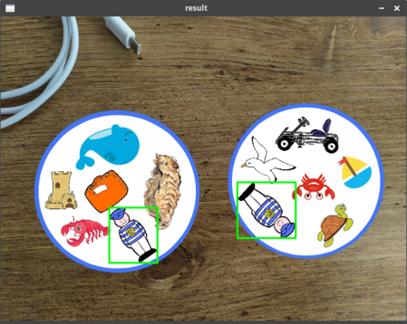
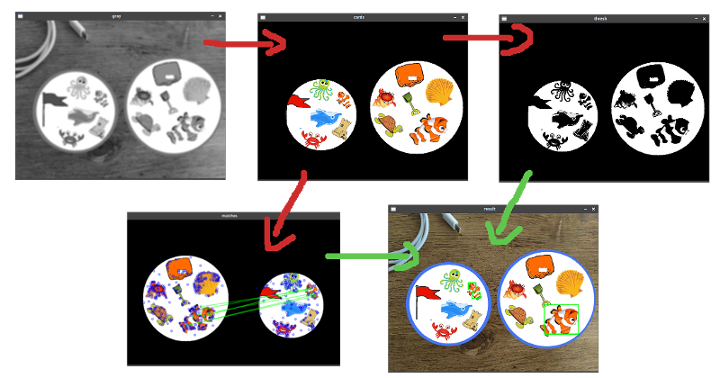

# Double game 
[](https://opensource.org/licenses/mit)
[](https://img.shields.io/badge/openCV-%3E%3D%204.2-green)  
A program to find the common element on the double's game


## How to use
You need the non free algorithms of openCV, so I compile it from source with this command:
```sh
cmake -D CMAKE_BUILD_TYPE=RELEASE \
      -D CMAKE_INSTALL_PREFIX=/usr/local \
      -D OPENCV_GENERATE_PKGCONFIG=ON \
      -D OPENCV_ENABLE_NONFREE=ON \
      -D OPENCV_EXTRA_MODULES_PATH=~/opencv_src/opencv_contrib/modules ../opencv
```
Test the detection of the common element:
```sh
python3 doublegame.py test/card_06.png
```
You will obtain something like this:  


## How it works

* Read image
* Transform into grayscale
* Detect the cards (circles)
  * Apply a blur to improve the [HoughCircles](https://docs.opencv.org/master/da/d53/tutorial_py_houghcircles.html) detection
* Extract the cards for an image without background
* Apply a threshold for the contours detection
* Make a [FLANN matching](https://docs.opencv.org/master/dc/dc3/tutorial_py_matcher.html) between each card to find the macthing points
* For each match, retrieve the corresponding contour to draw the bounding rect

